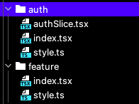
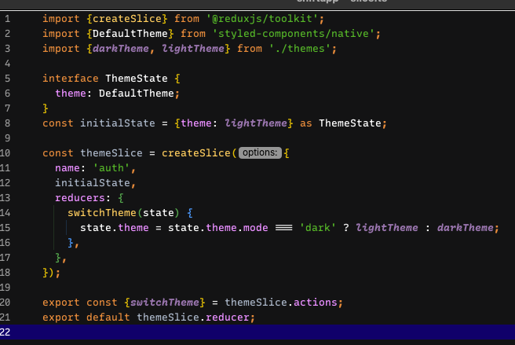
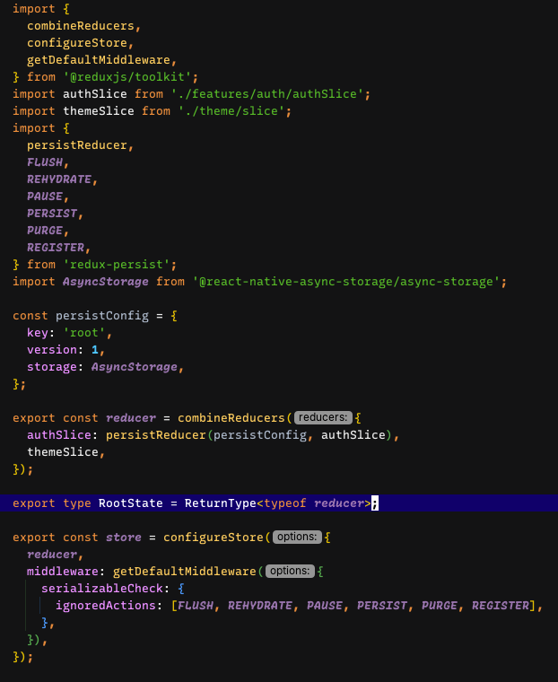
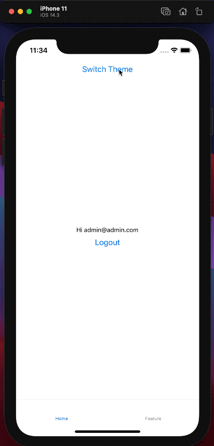

# Shift App
A starter app using React Native, Redux, Redux Toolkit, Redux Persist, Firebase and Styled Components. 

### Requirements and resolutions:
- The starter project should be easy to customize, but also be opinionated about file structure, coding styles, etc.
    - The file structure is simple to create new features, we only need to create a new folder under features folder with: 
      - `index.tsx`: Tthe react component
      - `slice.ts`: All Feature Redux logic using createSlice by Redux Toolkit <3
      - `style.ts`: Custom components stylized using styled-components.
      
        
        
- Simple login screen with login functional enable using Firebase Auth (could be email sign in or Google sign in)
    - This boilerplate is using Email sign-in approach using `react-native-firebase` lib.
    - The `router.ts` file owns the logic that verify if the user is logged or not to make the route decision. This file is connected to redux store, specifically to AuthSlice Reducer, which is persisted using Redux Persist.
    
- Tab based navigation using React Navigation
    - Using `createBottomTabNavigator()` from `@react-navigation/bottom-tabs` this requirement is ok.
    
- Base redux implemented (using redux-toolkit if possible or regular redux if not). You can save there any value related to the user like his email address.
    - Redux Toolkit is awesome/easy to implement the Redux ecosystem, ie on Auth feature (persited): 
    
    
  
    - To create the store, Redux Toolkit functions helps store creation, reducers combination, middlewares applications:
    
    

- Theme support (an easy way to support multiple themes across the app)
    - To get this requirement done, a slice for theme was created and the logged area was connected with this 'them reducer': _src/theme/slice.ts_
    - All Styled Components under the ThemeProvider receives a prop named theme representing the current theme.
      
       

### To run this boilerplate:

- `git checkout https://github.com/patrickgodinho/shiftapp.git`
- `cd shiftapp`
- `yarn`
- `cd ios && pod install && cd ..`
- `yarn ios`
- username: `admin@admin.com`
- password: `adminadmin`

### Any question or suggestion?:
- Please open an issue :)
